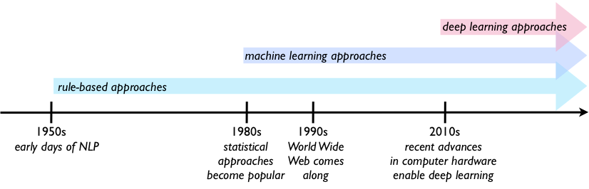

# Academic Language Analysis

Analyzing jargon density and readability in ecology research papers to understand how language complexity affects citation impact.



---

## What This Does

1. **Fetches papers** from OpenAlex API (ecology/open-access)
2. **Enriches metadata** with Crossref and Unpaywall
3. **Stores everything** in MongoDB with structured schemas
4. **Extracts entities** from abstracts using LLM (methods, subjects, findings)
5. **Calculates jargon scores** by comparing text against common word lists

---

## Quick Start

### 1. Setup (windows version, will be slightly different for mac)

```bash
# clone and enter project
cd academic-language-analysis

# create virtual environment
python -m venv venv

# activate it
# Windows:
.\venv\Scripts\activate
# Mac/Linux:
source venv/bin/activate

# install dependencies
pip install -r requirements.txt
```

### 2. Configure Environment

Create a `.env` file in the project root:

```env
# MongoDB Atlas credentials
mongo_DB_user=your_username
mongo_DB_pass=your_password
mongo_DB_host=your-cluster.mongodb.net

# OpenAlex API
TOPIC_ID=C202889954   # Ecology concept ID
EMAIL=your@email.com
BASE_URL=https://api.openalex.org/works

# Optional: for LLM extraction
LANGEXTRACT_API_KEY=your_api_key
```

### 3. Fetch Papers

```bash
python data_cleaning/get_papers.py
```

This will:
- Query OpenAlex for ecology papers (2024-2026, open access)
- Enrich with Crossref/Unpaywall data
- Store in MongoDB `papers` collection

### 4. Check Database Status

```bash
python data_cleaning/extract.py --status
```

### 5. Extract Entities from Abstracts

```bash
# process 5 papers (default)
python data_cleaning/extract.py

# process more
python data_cleaning/extract.py -n 20

# skip visualization
python data_cleaning/extract.py --no-viz

# re-run on already processed papers
python data_cleaning/extract.py --reprocess
```

Results saved to:
- MongoDB `extracted_features` collection
- `data_cleaning/output/visualization.html` (open in browser)

### 6. Calculate Jargon Scores (Pilot)

```bash
python data_cleaning/pilot_script.py
```

---

## Project Structure

```
academic-language-analysis/
├── .env                    # your credentials (don't commit!)
├── .gitignore
├── requirements.txt
├── README.md
│
├── Database/
│   ├── __init__.py
│   └── db.py               # MongoDB connection + schema setup
│
├── data_cleaning/
│   ├── __init__.py
│   ├── get_papers.py       # Stage 1: fetch & store papers
│   ├── extract.py          # Stage 2: LLM entity extraction
│   ├── pilot_script.py     # jargon scoring prototype
│   │
│   ├── lib/
│   │   ├── __init__.py
│   │   └── util.py         # helper functions
│   │
│   ├── dictionaries/       # common word lists
│   │   └── google-10000-english-usa-no-swears-medium.txt
│   │
│   └── output/             # generated files
│       ├── extraction_results.jsonl
│       └── visualization.html
│
└── assets/
    └── overview.png
```

---

## MongoDB Schema

### papers (primary collection)
```json
{
  "_id": "openalex_id_or_doi",
  "title": "Paper Title",
  "year": 2025,
  "authors": [{"name": "...", "affiliation": "..."}],
  "journal": {"name": "...", "issn": "..."},
  "impact": {
    "citation_count": 45,
    "citations_per_year": 22.5,
    "classification": "HIGH",
    "influential_citations": 12
  },
  "open_access": {"is_oa": true, "pdf_url": "...", "status": "gold"},
  "content": {"abstract": "...", "full_text_extracted": false, "local_path": null},
  "processing_status": "pending_download",
  "tags": ["Ecology", "Climate Change"]
}
```

### snapshots (citation tracking over time)
```json
{
  "paper_id": "...",
  "snapshots": [
    {"date": "2026-01-01", "count": 45},
    {"date": "2026-02-01", "count": 52}
  ]
}
```

### extracted_features (LLM extraction results)
```json
{
  "paper_id": "...",
  "script_version": "v1.0",
  "data_points": {
    "extractions": [...],
    "extraction_count": 8
  }
}
```

---

## Processing Status Flow

```
pending_download → downloaded → pending_parse → parsed
                                              ↘ failed
no_pdf_available (if no PDF link found)
```

---

## Citation Impact Classification

| Citations | Classification |
|----------:|----------------|
| 0 | Uncited (25-50% of papers) |
| 1-10 | Low (niche audience) |
| 11-50 | Moderate (solid contribution) |
| 100+ | High (influential) |
| 1,000+ | Citation Classic |

---

## Key Metrics

- **Jargon density**: % of words not in common word list
- **Citations per year**: normalized impact score
- **Readability**: Flesch/NDC-style scores (planned)
- **Equation density**: mathematical complexity (planned)

---

## Data Sources

| API | What it provides |
|-----|------------------|
| OpenAlex | metadata, concepts, citations, OA status |
| Crossref | DOI metadata, affiliations |
| Unpaywall | PDF URLs, OA license info |

---

## References

- Plavén-Sigray et al. (2017) - readability trends over 130 years
- Rakedzon et al. (2017) - De-Jargonizer methodology
- Martinez & Mammola (2021) - jargon vs citation counts
- Fawcett & Higgins (2012) - equation density effects

---

## Troubleshooting

**MongoDB connection error (localhost refused)**
- You're probably missing Atlas credentials in `.env`
- Make sure `mongo_DB_user`, `mongo_DB_pass`, and `mongo_DB_host` are set

**No papers to process**
- Run `get_papers.py` first to fetch papers
- Check `--status` to see what's in the database

**Import errors**
- Make sure you're running from the project root
- Activate your virtual environment first

---

## License

MIT